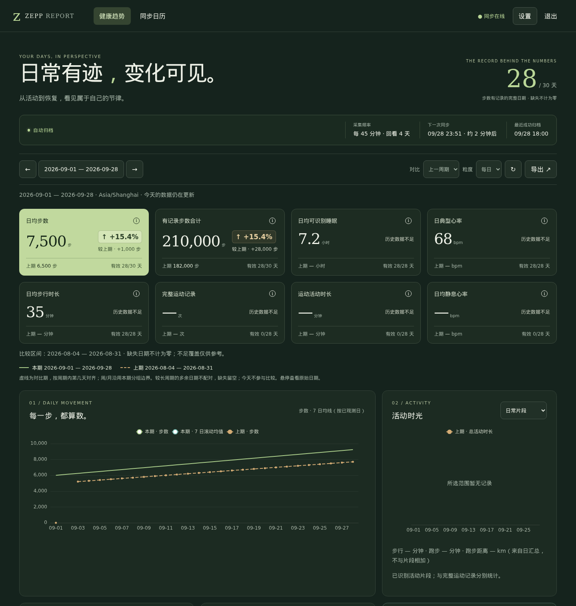
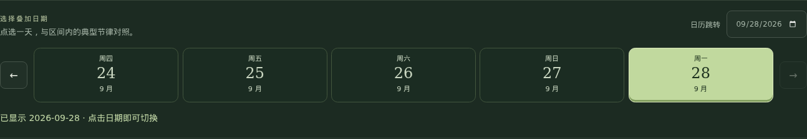
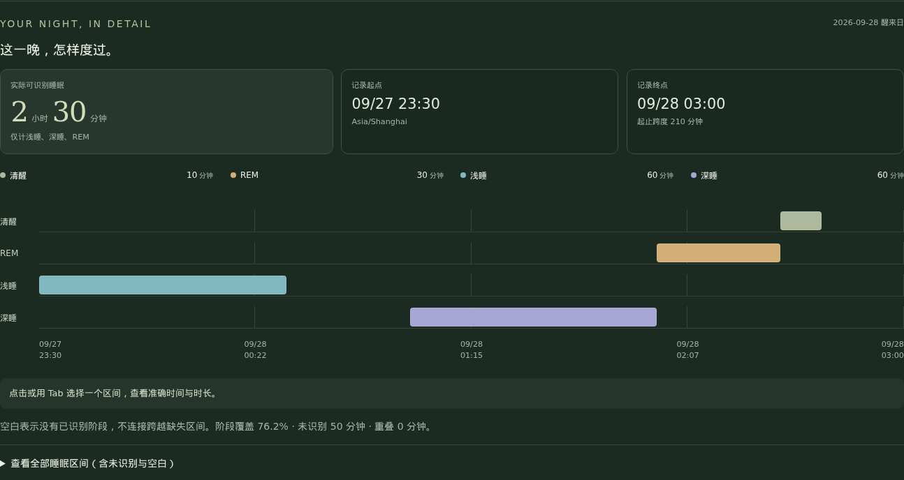
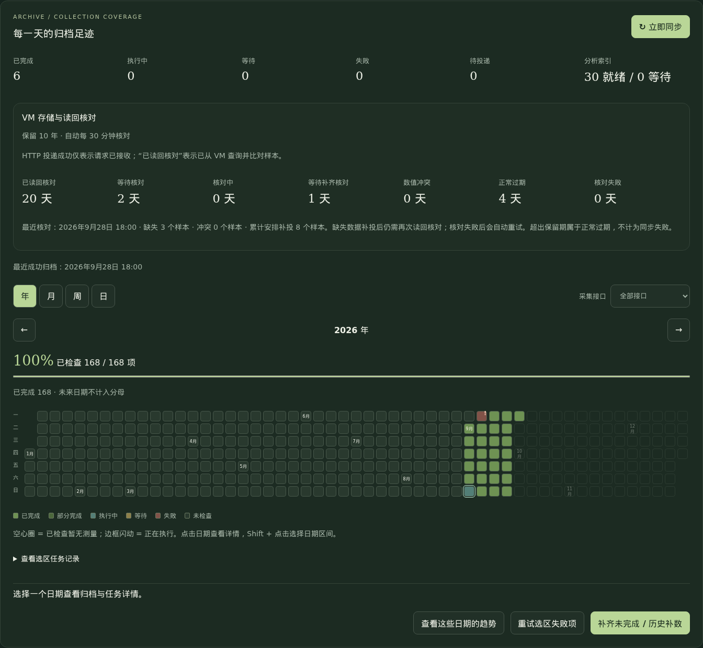

# Zepp Report

一个 All-in-One Zepp exporter：定期采集 Zepp 云端健康数据，保存在 SQLite 原始归档中，通过中文 Web UI 查看趋势和明细，并写入 VictoriaMetrics。仓库提供单机 VictoriaMetrics 和可选 Grafana 的 Docker Compose 配置，也支持已有 VM/Grafana。

接口及编码格式参考 [zepp-export](https://github.com/EvanCooke/zepp-export)，许可见 [THIRD_PARTY_NOTICES.md](THIRD_PARTY_NOTICES.md)。这是非官方客户端，兼容性取决于账号区域、设备及上游接口；只能读取已经同步至 Zepp 云端的数据。

## 能力

- 采集步数、距离、热量、心率、压力、血氧、睡眠、活动片段、完整运动摘要，以及 ATL/CTL/TSB、TRIMP、运动负荷、VO₂ Max 等已识别训练字段。
- 默认每 **30 分钟**同步一次，回看 **3 天**；首次回填 **30 天**。日期 × 接口任务持久化，重启继续，Token 失效暂停，更新后恢复。
- 中文响应式 Web UI：日期范围与自然周期、同比/环比、睡眠阶段和作息、典型一天、年/月/周/日同步覆盖、补采预览。
- 单日原始明细：分钟步数及带原始时间戳的采样、睡眠区间、活动与运动记录；支持缩放与完整分页表。
- 图表自适应降采样：步数按区间求和，其余采样保留峰谷；放大恢复细节，原始表和归档不减少数据。缺失不补零，真实零值保留。
- VM 持久投递队列和周期读回核对，发现缺失后补投；值冲突单独报告。Grafana 原生 VictoriaMetrics 数据源及预置健康看板。

VO₂ Max 仅展示能识别的上游字段，不保证所有设备格式兼容。体温与 GPS 轨迹未实现。日常活动片段和完整运动记录是不同来源，不应相加。分钟步数仅解码并校验已确认的格式；未知格式、日总量不一致或未验证的夏令时日期不会推算明细。

## 界面预览

以下截图来自真实 Web UI，使用合成测试数据演示，不包含个人健康记录。数值、同步状态与采集配置仅为示例。

**健康趋势**：紧凑卡片突出变化百分比、上期值和有效观测天数；趋势图用本期实线与对比期虚线展示变化，可切换上一周期或去年同期。



**单日切换**：在「典型的一天」直接点选日期，选中项高亮；支持前后一天与日历跳转，点击即读取。



**单日睡眠**：按醒来日期查看浅睡、深睡、REM 与清醒区间；未识别或缺失区间保留空白。



## 一体化部署

需要 Docker Engine 和 Docker Compose。默认启动 `zepp-report` 与 `zepp-vm`（VictoriaMetrics 单机版 **v1.145.0**），保留 **3650 天**。Grafana 使用可选 profile。

```sh
cp .env.example .env
chmod 600 .env
# 编辑 .env，填写至少 12 字符的 ADMIN_PASSWORD
sudo install -d -m 700 -o 1000 -g 1000 data vm-data
# 仅启用 Grafana 时需要
sudo install -d -m 700 -o 472 -g 472 grafana-data
# 仅公开不含凭据的 Grafana 配置，确保容器可读
chmod -R a+rX grafana
docker compose config --quiet
docker compose pull
docker compose up -d --no-build
# 可选：同时启动并自动配置 Grafana
docker compose --profile grafana pull
docker compose --profile grafana up -d --no-build
```

默认应用镜像来自 GHCR。可在 `.env` 固定 `APP_IMAGE` 的版本或 SHA 标签；私有镜像需要先登录 GHCR。

默认仅在 Compose 网络内 expose `8000`（Web UI）、`8428`（VM）和 `3000`（Grafana），**没有宿主机端口映射**。按自己的环境配置反向代理，或创建 `compose.override.yaml`，例如仅映射本机：

```yaml
services:
  zepp-report:
    ports:
      - "127.0.0.1:8000:8000"
  zepp-grafana:
    ports:
      - "127.0.0.1:3000:3000"
```

重新执行启动命令后，本机访问 `http://127.0.0.1:8000`。远程访问可使用 SSH 隧道或反代。Compose 中提供了注释形式的 Traefik labels 示例；需自行配置域名、入口、证书和代理网络。VM 不需要对公网开放。

HTTP 部署默认 `COOKIE_SECURE=false`；HTTPS 反代部署设置 `COOKIE_SECURE=true`。Web UI 使用 `ADMIN_PASSWORD` 登录。Grafana 默认用户名 `admin`，初始密码使用 `GRAFANA_ADMIN_PASSWORD`，未设置则沿用 `ADMIN_PASSWORD`；已有 Grafana 数据目录中的密码不会被环境变量自动重置。

### 配置

| 变量 | 默认值 / 说明 |
| --- | --- |
| `ADMIN_PASSWORD` | 必填，至少 12 字符 |
| `COOKIE_SECURE` | `false`；HTTPS 时设 `true` |
| `ZEPP_ACCOUNT` | `personal`，用于 VM 的账号标签 |
| `ZEPP_USER_ID` / `ZEPP_TOKEN` | 可留空，在 Web UI 设置 |
| `ZEPP_REGION` / `ZEPP_TIMEZONE` | `global` / `Asia/Shanghai` |
| `VM_IMPORT_URL` | `http://zepp-vm:8428/api/v1/import` |
| `VM_QUERY_URL` | `http://zepp-vm:8428`，读回核对使用的查询根地址 |
| `VM_MEMORY_LIMIT` | `1g`，内置 VM 容器内存上限 |
| `VM_CPU_LIMIT` | `2`，内置 VM CPU 核数上限 |
| `VM_RETENTION_DAYS` | `3650`，内置 VM 保留期及应用核对边界 |
| `VM_DEDUP_INTERVAL_SECONDS` | `.001`，与 VM 的 1 毫秒去重设置对应 |
| `VM_BEARER_TOKEN` | 外部 VM 需要时设置 |
| `GRAFANA_ADMIN_PASSWORD` | 可选，覆盖 Grafana 初始管理密码 |
| `APP_IMAGE` | 可固定为已发布镜像的版本或 `sha-<完整提交SHA>` 标签 |

`./data` 保存 SQLite 和设置，容器 UID/GID 为 `1000:1000`；`./vm-data` 属于 `1000:1000`，`./grafana-data` 属于 `472:472`。仅调整本项目目录权限。Grafana 的只读配置目录也必须对容器可读：`chmod -R a+rX grafana` 仅用于仓库内不含秘密的配置，不能用于 `.env` 或数据目录；若继承了 ACL，还需检查目录遍历与读取权限。应用只运行一个实例和一个 Uvicorn worker，数据目录锁会阻止双调度。

Zepp 环境变量仅用于首次初始化；`data/settings.json` 已存在时，以 Web UI 保存的配置为准。已有归档后不允许更换用户 ID、区域或时区；不同账号应使用独立目录和账号标签。

### 获取 Token

在 Zepp 的 `user.huami.com` 登录流程中获取用户 ID 与 `apptoken`，操作参考 [zepp-export 的认证说明](https://github.com/EvanCooke/zepp-export#authentication)。在 Web UI → 设置中填写用户 ID、Token 和区域。不要把 Token 或 `.env` 提交到版本控制。Token 过期时更新设置，原有队列会继续。

### 使用外部 VictoriaMetrics

设置 `VM_IMPORT_URL`、`VM_QUERY_URL`、实际 `VM_RETENTION_DAYS` 和实际 `VM_DEDUP_INTERVAL_SECONDS`，然后只启动应用：

```sh
docker compose pull zepp-report
docker compose up -d --no-build zepp-report
```

应用没有对内置 VM 的 `depends_on`，不会因此启动 `zepp-vm`。地址必须从应用容器可达。单机 VM 使用 `/api/v1/import` 和查询根地址；集群示例为 `http://vminsert:8480/insert/0/prometheus/api/v1/import` 与 `http://vmselect:8481/select/0/prometheus`。外部 VM 保留期和去重设置需自行配置，应用不会修改它们。Grafana 配置见 [grafana/README.md](grafana/README.md)。

## 历史回溯、核对与恢复

Web UI → 同步日历 →「补齐未完成 / 历史补数」，选择起止日期并确认预览。默认跳过完成项；仅勾选重新获取时强制采集。一次回溯最多 3650 天，趋势查询最多 366 天。失败任务可按选区预览后重试。

下图使用合成测试数据展示同步日历、VM 读回核对状态与历史补数入口。



- 重启后恢复未完成任务；数据、待投递样本和任务检查点在同一 SQLite 事务中保存。
- Token 失效暂停上游采集，已有 VM 投递仍可继续；网络错误与 VM 不可用会退避重试。
- **HTTP 投递成功不等于持久化已核对。** 应用默认每 30 分钟按配置同步周期读回 VM，比对已有归档样本，缺失后补投并再次核对；同步页区分待投递、等待核对、已核对、冲突和失败。
- VM 保留期之外的日期标为正常过期，不作为同步失败反复补投；SQLite 原始归档不会因此删除。
- 核对允许 VM 浮点存储精度造成的极小舍入差（见 [VM 数据模型](https://docs.victoriametrics.com/victoriametrics/keyconcepts/)）；真实值差异仍报告冲突。
- 相同指标和时间戳的值修订可能与 VM 已有值冲突。不会假设重复导入可以覆盖旧值，也不会自动删除 VM 历史。Web UI 可显示最新归档，而 Grafana 仍可能显示旧值。

需要重建 VM 时，在 Web UI 导出指定日期范围的 JSONL，将其导入保留期足够的**新实例或新租户**，核验后切换查询目标。导出仅包含选定区间，推荐截止昨天；当天汇总仍可能变化。下载文件不会自动清除冲突状态。

## 备份、恢复与升级

应用在线备份使用 SQLite backup API，包含已提交 WAL 数据与持久任务队列：

```sh
docker compose exec zepp-report python -m zepp_report.admin backup /app/data/backups/archive-backup
```

目标目录必须不存在；确认其中有 `BACKUP_COMPLETE`。备份含健康数据及 Token，应复制到独立存储并限制访问；另行保存 `.env`。不要在运行时仅复制数据库主文件而忽略 WAL。

恢复应用时先停止 `zepp-report`，保留原 `data` 目录，在新的 `data` 中放入备份的 `zepp.sqlite3` 和 `settings.json`，设置 UID/GID `1000:1000`、目录权限 700、文件权限 600 后启动。不要复制运行中的 `worker.lock`。未完成任务继续，登录会话需重新建立。

SQLite 备份不包含 VM 或 Grafana。完整冷备份可先 `docker compose --profile grafana stop`，再复制 `data`、`vm-data`、`grafana-data`、`.env` 和 Compose 自定义文件，保留属主与权限；恢复时使用对应服务版本。不要直接复制正在写入的 VM 数据目录。

升级前备份，再执行 `docker compose pull` 和 `docker compose up -d --no-build`；启用 Grafana 时两个命令均加 `--profile grafana`。使用固定镜像时可执行 `docker compose pull zepp-report` 和 `docker compose up -d --no-build zepp-report`。保留原挂载目录。分析索引和新增指标会按持久检查点从归档重建，不必重新下载全部 Zepp 历史。回退先核对版本与数据库兼容性，勿用旧备份覆盖升级后新增的数据。

## 统计口径

默认展示至昨天的最近 30 个完整日；包含今天时图表显示进行中数据，周期比较仍排除今天。日均值按有效观测日计算并展示覆盖天数，缺失不补零。

对比曲线按周期内第几天对齐，周/月采用本期的分组边界，悬停可查看两期原始日期；周期长度不同时，多余日期不配对，卡片汇总仍使用各自完整统计区间。合计指标在周期长度不同时按有记录日均值计算变化，并标注「按日均」；基期为零时只显示变化量，不计算百分比。

心率/压力/血氧日分位来自当日样本；周/月分布使用每日中位数。典型一天先计算每天 5 分钟桶中位数，再跨日等权计算分布（最多 288 桶）；不足 2 天不画基线，不足 5 天不画分位带。它描述已有观测，不是医学正常范围。

睡眠按醒来日期归档。实际睡眠仅含已识别且无冲突的浅睡、深睡和 REM；未知、重叠和缺段另列。历史 `sleep_minutes` 指记录跨度，与实际睡眠口径不同。

`zepp_steps_minute` 是分钟内步数，属于 gauge，不能当累计 counter 求速率。VM 日报为本地零点样本，今天使用独立 current 快照。同步遥测定期推送，过期时应显示未知。

## 常见问题

| 现象 | 检查方式 |
| --- | --- |
| 启动失败 | `docker compose config --quiet`，检查管理密码长度与目录属主，再查看 `docker compose logs --tail=100 zepp-report` |
| 无法从浏览器访问 | 默认没有 host ports；检查端口映射或反代网络 |
| HTTP 登录后仍未登录 | 检查是否误设 `COOKIE_SECURE=true`；HTTPS 应保持 true |
| 没有健康数据 | 确认设备已同步至 Zepp 云端，检查账号区域、Token、日期与接口覆盖 |
| VM 待投递或核对失败 | 检查容器间地址、鉴权、查询端点和 VM 日志；采集归档仍保留 |
| 旧日期正常过期 | 对照 VM 的实际保留期；应用配置不能延长外部 VM 保留期 |
| Web UI 与 Grafana 不一致 | 检查账号标签、时区、待投递/待核对状态、修订冲突及不同统计口径 |
| Grafana 没有看板或插件 | 确认使用 `--profile grafana`，检查插件安装网络与 provisioning 日志 |

## 从源码构建

需要本地构建时，在仓库根目录运行 `docker compose build zepp-report`，再运行 `docker compose up -d --no-build`；或使用 `docker compose up -d --build`。构建需要访问 Python/npm 软件源，`BUILD_NETWORK` 默认 `default`，可按环境调整。

## 开发与验证

```sh
python3 -m venv .venv
.venv/bin/pip install -r requirements-dev.txt
npm ci
npm run build
export ADMIN_PASSWORD='local-test-password-long'
export COOKIE_SECURE=false
.venv/bin/uvicorn zepp_report.app:create_app --factory --host 127.0.0.1 --port 8000
```

```sh
.venv/bin/python -m pytest -q
npx playwright install chromium
npm run test:ui
# 可选，需要本地 Docker 镜像的隔离 VM 集成测试
.venv/bin/python scripts/integration_vm.py
```

会话鉴权 API 包括 `/api/status`、`/api/coverage`、`/api/tasks`、`/api/analytics/trends`、`/api/analytics/profile`、`/api/days/{day}`、`/api/activities` 和 `/api/export`。`POST /api/sync/preview` 仅预览；`POST /api/sync`、`POST /api/retry` 执行选区任务，写操作有同源保护。

Docker 多阶段构建打包本地前端，无 CDN 依赖。第三方前端许可证位于 `/static/dist/THIRD_PARTY_LICENSES.txt`。GitHub Actions 执行测试、镜像构建和容器验证；发布标签与权限以仓库工作流和 GHCR 包设置为准。
